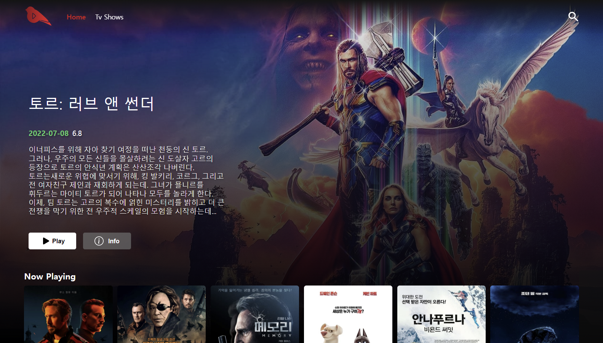

## ❣ Biflix-movie-app 회고록 🧐

### Netflix Clone with ReactJS

❗아직 작업 중....✒

- 사용 기술
- 기능

---

### 소개 📬

추천 동영상 정보를 끌어와 영상 리스트로 표현한 작은 앱 입니다. 

  

### 사용 기술

#### FrontEnd

### 이전과는 무엇이 바뀌었는가

반응형 디자인

#### 접속 화면 크기에 따른 컨텐츠 규격 변화

사용자의 접속 환경에 따라 유연하게 대응하기 위해, 
고정된 값을 주는 것 대신, 화면 규격에 따라 계산된 값을 넣되, 
이미지 등 컨텐츠의 적정 비율을 유지하면서 변화하도록 만들었습니다.

비디오 자동 재생

#### 비디오 트레일러 데이터 요청 및 자동 재생

모달이 열리는 것을 트리거로, api요청을 보내어, 
받아온 비디오 주소를 프론트에 반영하고, 자동 재생시키도록 만들었습니다.

